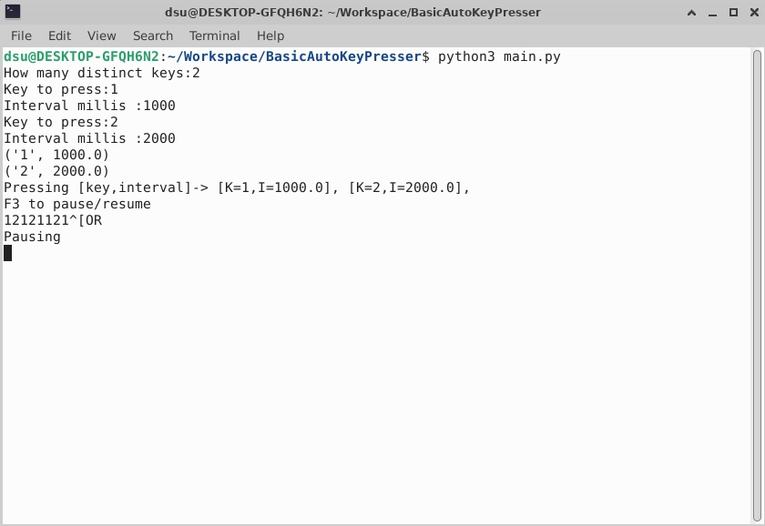

# BasicAutoKeyPresser

Some key presser from the internet asked me 5$ to use it, come on...

Not bundled on purpose, it's better to see what you run.

### Installation

* Check that you have python installed. `python --version`. If not use the official python installer : https://www.python.org/downloads/windows/ 
* Install dependencies `pip install -r requirements.txt`
* Run it `python main.py`

---
Pin to taskbar in windows 11 :
* Create shortcut for `main.py`
* Find the path to your pyton installation in cmd `where python`
* Right click shortcut; Properties; edit *Target*.
* Add the full path of python.exe before the script. 

For example
Target : `C:\Tools\Python3\python.exe C:\Downloads\BasicAutoKeyPresser\main.py`

You can pin your shortcut to start now.

---

### Cutting edge UI

Published under [WTFPL](https://es.wikipedia.org/wiki/WTFPL) licence.

Change requests and contributions are welcome.
I just spent more time on readme than on the code...
